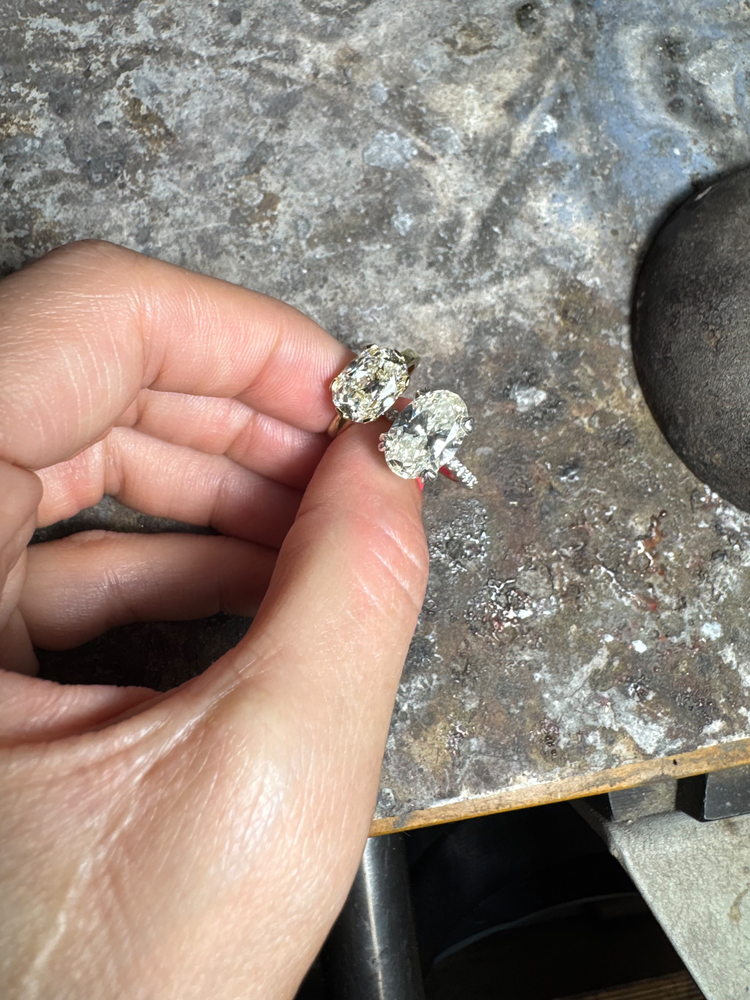

# How we source a colored gemstone for a custom ring

You can send me a picture of a ring. You can also send me a picture of the ocean, or a green jacket, or three completely different stones and tell me there is something about all of them that you like but you cannot explain what it is yet.

That's useful. We can start there.

Sourcing a colored gemstone for a custom ring starts with figuring out what you actually want to look at every day, then finding a stone that works for your design, your budget and the way you wear jewelry. The name of the gemstone is part of that conversation. It doesn't have to be the first thing you know.

## This is a family specialty

My family has been in the jewelry business since 1979, with a particular specialty in colored stones. We have dealer relationships all over the world that span a lifetime. In my case, quite literally.

One of our tourmaline dealers is such a close family friend that he used to read me bedtime stories when I was six. At my insistence, apparently I was very clear about what I wanted even then.

So when I talk about our sourcing relationships, there are actual people and a lot of shared history behind that. Some of these people knew me as a little girl, and now I get to work with them to find stones for the pieces we make. I love that.

Ring Mint brings that background into a very personal process. You work with me, we talk about what you want, and we can look beyond whatever happens to be sitting in a finished ring already.

I work with natural and lab-grown diamonds, both colored and colorless, as well as colored gemstones. I love having those options because the right place to start depends on the person. Sometimes the stone itself is the whole point. Sometimes you are attached to a color and a feeling, and we have room to explore how to get there.

Those relationships don't mean every stone exists in every size at every budget. They mean we have a place to begin a real search, and experience to bring to the decisions along the way.

## Tell me what you mean by green

Green can mean a lot of things.

A pale watery green, a yellow-green, a darker forest green, something blue-green that looks almost like the sea. Two people can both ask for a green engagement ring and have completely different pictures in their heads.

If you have a reference, send it. Then tell me what you like about it. Is it the color, the shape, the way the stone looks soft rather than bright, or the whole ring together?

That last question matters because you might be responding to the combination of the stone and the metal, and if we pull the stone out of that picture and put it in a completely different setting, we may have lost the thing you liked.

Here is a useful starting brief:

- The color you keep coming back to, including colors you don't want.
- Shapes you like, and whether you are open to alternatives.
- How large you want the stone to look on your hand.
- The metal and overall feeling of the ring.
- Your budget for the finished piece and any date we need to work toward.
- Whether natural or lab-grown origin matters to you.

You don't need every answer. A clear “definitely not that” can be surprisingly helpful.

## Carat is weight. It doesn't tell you how big a stone will look.

People forget this, and I understand why. You have a number in your head, maybe you have always wanted a 1.5ct stone, and that number starts to feel like the thing you are shopping for.

But carat is a unit of weight. It isn't a measurement of how much of your finger the stone will cover.

A 1ct round can look noticeably smaller than a 1ct oval or marquise, depending on the actual proportions. An elongated shape can take up more space along your finger, even when the weight is the same. That doesn't mean every oval looks bigger than every round. It means we need to look at the stone, its measurements and how it is cut, not just the number beside it.

And sometimes two stones that are both close to 3ct can look dramatically different.

Look at these two.

*Left: 2.94ct. Right: 2.84ct. The stone that looks larger in this photograph actually weighs less. Photograph and weights supplied by Chloe.*

The one on the right is 0.10ct lighter. If you were choosing by weight alone, you would miss a pretty important part of what you are actually seeing.

A photograph isn't a substitute for measurements, and I wouldn't use this picture alone to judge either stone's cut quality. But it shows why I want you looking beyond the carat number.

## I look at millimeters, cut and your hand together

The length and width in millimeters tell us about the stone's outline when you look down at it. Depth matters too, both for the stone itself and for the setting we can build around it.

I try to balance those measurements with a well-cut stone and the proportions that make sense for your ring size, because the same stone is going to have a different presence on different hands, and chasing the biggest possible outline doesn't automatically give you the most beautiful ring.

You can absolutely have a carat preference. Tell me. I just want us to look at what that preference means in real life, and leave room for a stone that looks right on you even if its weight isn't the exact number you started with.

If you want a low ring, we need to look at the depth of the actual stone. If you want an east-west design, we need to look at its proportions across your finger. If there is a wedding band you want to keep wearing, I want to see that too.

A stone can be beautiful and still ask you to compromise on a part of the ring you really care about. It's better to discover that while we are comparing options.

## What I would want you to understand about a shortlist

Looking at several stones should help you make a decision. It shouldn't feel like being handed more homework.

For each option, the useful questions are: how close is the color, how does it look as it moves, what are its dimensions, what is known about its identity and treatment, and what does choosing it mean for the rest of the design?

I want you to be able to say, “I like this color more, but I prefer the shape of that one,” because now we have something specific to work with. You aren't being difficult. You're helping describe the stone you want.

Ask to see how a candidate looks in different lighting, too. A single flattering photograph is a very small amount of information to build an important decision around.

## Natural, lab-grown and treated are different questions

A color name isn't a material identification. “Mint” tells us about an appearance. It does not tell us what the stone is.

Likewise, natural origin doesn't tell you whether a gemstone has been treated. Before making a choice, we need to understand what is being offered and what information supports that description.

An appropriate laboratory report can help identify a gemstone and report detectable treatments. Geographic-origin opinions are available for certain stones and report services, but that is different from a complete record of every person who handled a stone. [GIA explains its colored-stone examination and report process here](https://www.gia.edu/gia-news-research/guide-how-gia-analyzes-colored-stones).

You should be able to ask these questions without feeling awkward. They belong in the conversation.

## We also need to talk about your hands

A ring worn occasionally and an engagement ring worn every day have different jobs.

Tell me if you work with your hands, if you take your rings off regularly, if you hate anything that sits high, if you want to forget you're wearing it. Those are design details too.

I try to find a balance between what you love and the practicalities of wearing it. Those two things both deserve a place in the conversation.

Take opals. Absolutely gorgeous. I understand falling in love with one. But for an engagement ring you want to wear every day, I would probably advise against an opal, particularly if your day-to-day life is hard on your hands or you don't want to think much about taking your ring off.

There are reasons for that. GIA puts opal at 5 to 6.5 on the Mohs hardness scale and describes its toughness as very poor to fair. It can scratch or break, and high heat or sudden temperature changes can cause fractures. That is a different set of considerations from simply liking the way it looks. [GIA's opal care guide](https://www.gia.edu/opal-care-cleaning).

But if your heart is truly set on an opal, I'm not going to pretend another stone will make you feel the same way just because it is a more practical recommendation. I want you to understand the choice you are making, what the care involves, where the risks are, and what we can and cannot address through the setting, and then we can have an honest conversation about whether it works for you.

A protective setting can help with some exposure. It cannot change the material itself.

My job is to give you the information, including the less exciting parts, so you can choose with your eyes open. You are the person who is going to wear this ring.

## The budget belongs in the first conversation

You can tell me your budget plainly. It gives the search direction.

It also helps us talk about priorities. If the exact color matters most, perhaps there is flexibility on shape. If the shape is the thing you love, perhaps we compare a slightly different shade. Sometimes the sensible answer is to keep looking, and sometimes it is to reconsider one part of the brief.

I would rather have that conversation while the choices are still open.

If you want to see how sourcing fits into the whole project, read about [our custom engagement ring process](https://ringmint.com/custom-engagement-rings/) and [what a wax try-on can show you](https://ringmint.com/blog/wax-model-ring-try-on/).

## And then there is that moment

We can talk about color and dimensions and reports and settings, and we should, but there is also just something about a stone.

You see it and you know.

That is the moment I'm looking for. The aha. THE stone.

It doesn't make the practical questions disappear. It means we have found something you actually feel connected to, and now all those conversations have somewhere to land. We can understand the stone, work through what it needs, and build the ring around it.

I want you to have that feeling and the information. Both.

## Send me what you keep saving

You don't need to arrive with a gemstone vocabulary and a finished design. Send me the screenshots, tell me which parts you love, and tell me what you haven't been able to find.

My family has spent decades working with colored stones. I would love to put that experience into something you actually get to wear.

[Talk to me about sourcing a stone for your ring](https://ringmint.com/contact/?ref=custom-colored-gemstone-sourcing).
